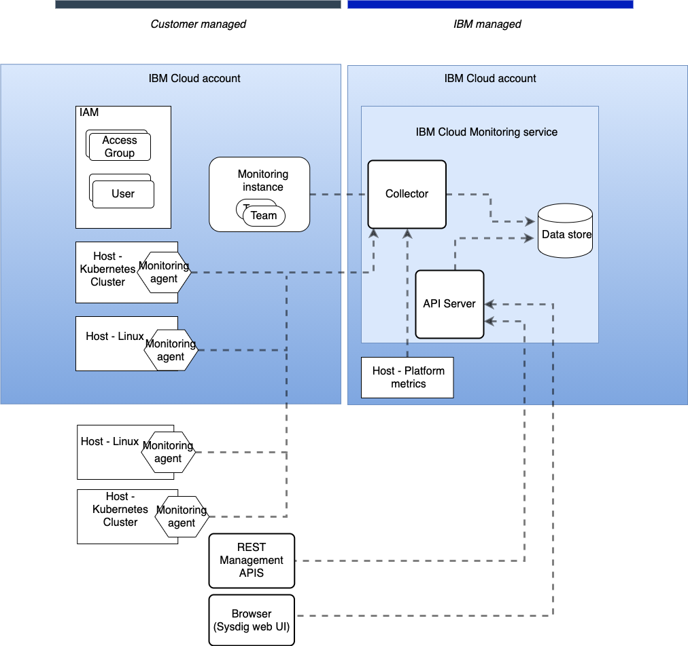

---

copyright:
  years: 2018, 2020
lastupdated: "2020-06-02"

keywords: Sysdig, IBM Cloud, monitoring, security, connection

subcollection: Monitoring-with-Sysdig

---

{:new_window: target="_blank"}
{:shortdesc: .shortdesc}
{:screen: .screen}
{:pre: .pre}
{:codeblock: .codeblock}
{:tip: .tip}
{:note: .note}
{:important: .important}
{:deprecated: .deprecated}
{:download: .download}
{:preview: .preview}

# Learning about {{site.data.keyword.mon_full_notm}} architecture and workload isolation
{: #compute-isolation}

Review the following sample architecture for {{site.data.keyword.mon_full_notm}}, and learn more about the workload isolation level that the service offers in the cloud.
{: shortdesc}

## {{site.data.keyword.mon_full_notm}} architecture
{: #architecture}

{{site.data.keyword.mon_full_notm}} is a highly available, multi-tenant, regional service that is available in {{site.data.keyword.cloud_notm}}. You can use it to monitor your applications, platform resources, and infrastructure.

The API server component provides a web and an API interface to the Sysdig service.

The collector component ingests data that monitoring agents forward to the Sysdig service.

The datastore component stores all metrics, metadata, events, instance credentials, and environmental data.

You can use monitoring agents to monitor and collect metrics and events from hosts such as a Kubernetes cluster or a Linux system. A monitoring agent connects to 1 Sysdig instance. The agent forwards data to the instance that is connected. 

Platform metrics are collected automatically for Sysdig-enabled services in each region. The data is forwarded to the {{site.data.keyword.mon_full_notm}} service instance that is enabled to collect and monitor platform metrics in a region.

The monitoring UI is the front-end component where users can monitor and manage hosts through dashboards, alerts, and events.

## {{site.data.keyword.mon_full_notm}} workload isolation
{: #workload-isolation}

Each regional deployment of the {{site.data.keyword.mon_full_notm}} service serves multiple tenants that are identified by the {{site.data.keyword.IBM_notm}} service instance.

* There is 1 deployment of the {{site.data.keyword.mon_full_notm}} service per region that is responsible for running user workloads in the region.
* The {{site.data.keyword.mon_full_notm}} service in a region is highly available. [Learn more](/docs/Monitoring-with-Sysdig?topic=Monitoring-with-Sysdig-ha-dr).
* The monitoring data that is collected and processed by the {{site.data.keyword.mon_full_notm}} service is associated with the Sysdig instance and not visible to the other service instances by virtue of this association.
* Data for all tenants is co-located in the same data stores and segmented by the tenant-specific metric tags that are associated with each metric to enforce access control policies.

You can use {{site.data.keyword.cloud_notm}} Identity and Access Management (IAM) to control which users see, create, use, and manage resources in your service instance. [Learn more](/docs/Monitoring-with-Sysdig?topic=Monitoring-with-Sysdig-iam).
* To grant access to manage the {{site.data.keyword.mon_full_notm}} in {{site.data.keyword.cloud_notm}}, you can assign platform roles that define users levels of access for completing platform management tasks and accessing account resources. 
* To grant access to manage the Sysdig monitoring instance and its resources, you can assign service roles that define users levels of access for viewing data and managing features such as dashboards, teams, and alerts.

Within a Sysdig instance, you can define teams to group users and control what data and resources are available for members of a team. 
* Adding users to a team is managed through IAM policies. [Learn more](/docs/Monitoring-with-Sysdig?topic=Monitoring-with-Sysdig-iam#iam_policies_team).
* User access to view, manage, and monitor data is granted through IAM policies.

