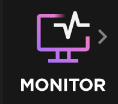
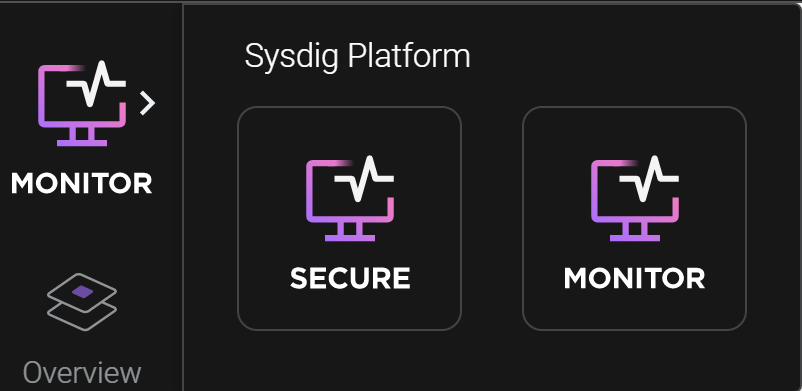

---

copyright:
  years:  2018, 2021
lastupdated: "2021-03-28"

keywords: IBM Cloud, monitoring, launch web UI

subcollection: monitoring

---

{{site.data.keyword.attribute-definition-list}}

# Navigating to the web UI
{: #launch}

After you provision an instance of the {{site.data.keyword.mon_full_notm}} service in the {{site.data.keyword.cloud_notm}}, and configure a monitoring agent for a metrics source, you can view, monitor, and manage metrics through the {{site.data.keyword.mon_full_notm}} web UI.
{: shortdesc}

## Grant IAM policies to a user to view data 
{: #launch_step1}

**Note:** You must be an administrator of the {{site.data.keyword.mon_full_notm}} service, an administrator of the {{site.data.keyword.mon_full_notm}} instance, or have account IAM permissions to grant other users policies.

The following table lists the minimum policies that a user must have to be able to launch the {{site.data.keyword.mon_full_notm}} web UI, and view data:

| Service                        | Role                      | Permission granted     |
|--------------------------------|---------------------------|------------------------|
| `{{site.data.keyword.mon_full_notm}}` | Platform role: Viewer     | Allows the user to view the list of service instances in the Observability Monitoring dashboard. |
| `{{site.data.keyword.mon_full_notm}}` | Service role: Writer      | Allows the user to launch the Web UI and view metrics in the Web UI.  |
{: caption="Table 1. IAM policies" caption-side="top"} 

For more information on how to configure these policies for a user, see [Granting permissions to launch the monitoring UI or to make REST API calls](/docs/monitoring?topic=monitoring-iam_grant).

## Launch the Monitor web UI through the {{site.data.keyword.cloud_notm}} UI
{: #launch_step2}

You launch the Web UI within the context of an {{site.data.keyword.mon_full_notm}} instance, from the {{site.data.keyword.cloud_notm}} UI. 

Complete the following steps to launch the web UI:

1. Log in to your {{site.data.keyword.cloud_notm}} account.

    Click [{{site.data.keyword.cloud_notm}} dashboard](https://cloud.ibm.com/login){: external} to launch the {{site.data.keyword.cloud_notm}} dashboard.

	After you log in with your user ID and password, the {{site.data.keyword.cloud_notm}} Dashboard opens.

2. In the navigation menu, select **Observability**. 

3. Select **Monitoring**. 

    The list of instances that are available on {{site.data.keyword.cloud_notm}} is displayed.

4. Select one instance. Then, click **Open dashboard**.

    The Web UI opens.

## Launch the Secure web UI
{: #launch_step3}

By default, the *Monitor* view opens when you launch the monitoring UI.

To access the *Secure* web UI, complete the following steps:

1. Log in to your {{site.data.keyword.cloud_notm}} account.

    Click [{{site.data.keyword.cloud_notm}} dashboard](https://cloud.ibm.com/login){: external} to launch the {{site.data.keyword.cloud_notm}} dashboard.

	After you log in with your user ID and password, the {{site.data.keyword.cloud_notm}} Dashboard opens.

2. In the navigation menu, select **Observability**. 

3. Select **Monitoring**. 

    The list of instances that are available on {{site.data.keyword.cloud_notm}} is displayed.

4. Select one instance. Then, click **Open dashboard**.

    The Web UI opens.

5. Click the **Monitor** icon.

    

    The *Platform* selection box opens.

    

    The selection box is only available for instances with the secure option.
    {: note}

6. Select the **Secure** icon.

    

