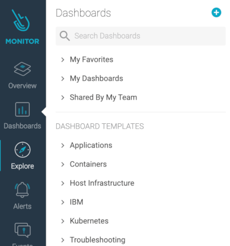
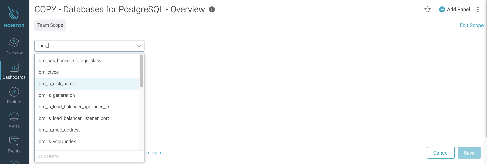
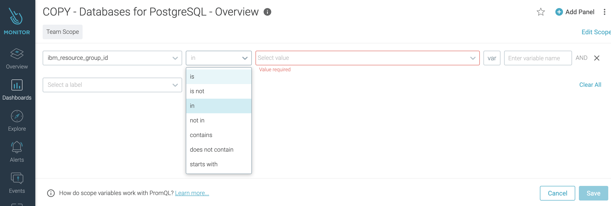

---

copyright:
  years:  2018, 2020
lastupdated: "2020-11-12"

keywords: Sysdig, IBM Cloud, monitoring, platform metrics

subcollection: Monitoring-with-Sysdig

---

{:new_window: target="_blank"}
{:shortdesc: .shortdesc}
{:screen: .screen}
{:pre: .pre}
{:table: .aria-labeledby="caption"}
{:codeblock: .codeblock}
{:tip: .tip}
{:download: .download}
{:important: .important}
{:note: .note}
{:external: target="_blank" .external}

 
# Working with platform metrics
{: #platform_metrics_working}

Platform metrics are metrics that are exposed by enabled-Sysdig services and the platform in {{site.data.keyword.cloud_notm}}. 
{:shortdesc}

* Platform metrics are regional. 

    You can monitor metrics from enabled-Sysdig services on the {{site.data.keyword.cloud_notm}} in the region where the service is available. 

* You can configure 1 instance only of the {{site.data.keyword.mon_full_notm}} service per region to collect *platform metrics* in that location. 

    To configure a Sysdig instance, you must set on the *platform metrics* configuration setting. 

    You must be assigned the IAM Editor role or higher for the IBM Cloud Monitoring with Sysdig service to configure platform metrics.

* If a Sysdig instance in a region is already enabled to collect platform metrics, metrics from enabled-Sysdig services are collected automatically and available for monitoring through this instance. For more information about enabled-Sysdig services, see [Cloud services](/docs/Monitoring-with-Sysdig?topic=Monitoring-with-Sysdig-cloud_services).

* To monitor platform metrics for a service instance, check that the {{site.data.keyword.mon_full_notm}} instance is provisioned in the same region where the service instance that you want to monitor is provisioned.

## Controlling what data is visible 
{: global-attributes}

You can use attributes to segment metrics so that you can define what data is visible to users.

The following global attributes are available for segmenting metrics:

| Attribute               | Attribute Name              | Attribute Description |
|-------------------------|-----------------------------|-----------------------|
| `Cloud Type`            | `ibm_ctype`                 | Type.  Valid values: `public`, `dedicated`, or `local` |
| `Location`              | `ibm_location`              | Location of the monitored resource.   This field can be set to a region, a data center, or global. |
| `Scope`                 | `ibm_scope`                 | Scope of the metric.   This field can be set to the account GUID, an organization GUID, or a space GUID. |
| `Service name`          | `ibm_service_name`          | Name of the service generating this metric. |
| `Service instance`      | `ibm_service_instance`      | Service instance GUID that identifies the instance the metric is associated with. |
| `Service instance name` | `ibm_service_instance_name` | Service instance name.  This field provides the user-provided name of the service instance which isn't necessarily a unique value depending on the name provided by the user. |
| `Resource group name`   | `ibm_resource_group_name`   | The resource group name where the service instance is created. |
| `Resource group ID`     | `ibm_resource_group_id`     | The resource group GUID where the service instance is created. |
{: caption="Table 1. Global attributes" caption-side="top"}

Other attributes are available per {{site.data.keyword.cloud_notm}} service. In the [Cloud services](/docs/Monitoring-with-Sysdig?topic=Monitoring-with-Sysdig-cloud_services) topic, identify the service tha you want to monitor and navigate the the *More info* section. Look for the section **Attributes for segmentation** to get the list of attributes that you can use to segment metrics for that service. 

You can control the data that is visible for analysis per team, per dashboard, and per panel in a dashboard. 

### Dashboards
{: global-attributes-1}

You can use global attributes to set the scope of dashboards:
- The scope defines the data that is valid for aggregation. 
- Only the data that is in scope is displayed. 
- The scope that is set at the dashboard level applies to all panels in the dashboard.
- You can override the main dashboard scope and specify a specific scope for a panel.

### Panels
{: global-attributes-2}

You can use global attributes to set the scope of a panel:
- The scope defines the data that is valid for aggregation. 
- Only the data that is in scope is displayed. 

### Teams
{: global-attributes-3}

You can use global attributes to define the data that is visible and available for analysis in a team.

 
## Monitoring platform metrics through dashboards
{: #platform_metrics_working_dash}

Each {{site.data.keyword.cloud_notm}} provides 1 or more dashboard templates that you can use to monitor that service. 

- Dashboard templates are available in the **Dashboards** section of the Sysdig web UI, under the **IBM** section. 

    

- Dashboard templates are only visible in the Sysdig web UI if you have an instance of the service running in that region.
- Dashboard templates cannot be customized. 

You can create a copy of a dashboard template. You can customize the copy of the dashboard.

### Creating a custom dashboard
{: #platform_metrics_working_dash-1}

Complete the following steps to create a custom dashboard:

1. [Launch the Sysdig web UI](/docs/Monitoring-with-Sysdig?topic=Monitoring-with-Sysdig-launch).
2. Navigate to the **DASHBOARD** section () in the Web UI.
3. In the **DASHBOARD TEMPLATES** section, expand **IBM**, and select a dashboard template for a service that you want to monitor.
4. Select **Create Custom Dashboard**. The window *Create Dashboard from Template* opens. 
5. Enter a name for your dashboard, and click **Create and Open**. The dashboard opens.

You can locate the dashboard that you have copied in the section **DASHBOARDS** &gt **My Dashboads**.

Next, customize the scope and panels in the dashboard.

### Defining the scope of a dashboard
{: #platform_metrics_working_dash-2}

Complete the following steps to define the scope of the data that is displayed through the dashboard:

1. [Launch the Sysdig web UI](/docs/Monitoring-with-Sysdig?topic=Monitoring-with-Sysdig-launch).
2. Navigate to the **DASHBOARD** section () in the Web UI.
3. Select a custom dashboard in the **My Dashboards** section.
4. To modify the scope, click **Edit scope**.

    

5. In the drop-down box, enter **ibm** and select an attribute. 

    

6. Select an operator.

    

7. Select 1 or more values.

    

    You can also leave the value empty, and select **var** to define a variable so that users can choose 1 or more values when they analyze data through the dashboard.
    {: note}

8. Continue adding more attributes. When you have the scope defined, click **Save**.

### Defining the scope of a panel
{: #platform_metrics_working_dash-3}

Complete the following steps to define the scope of the data that is displayed through a panel in a dashboard:

1. [Launch the Sysdig web UI](/docs/Monitoring-with-Sysdig?topic=Monitoring-with-Sysdig-launch).
2. Navigate to the **DASHBOARD** section () in the Web UI.
3. Select a custom dashboard in the **My Dashboards** section.
4. Select a panel where you want to change the scope of the data.
5. Select the *Pencil* icon . Then, in the *Scope* section, click **Dashboard scope**.

    

6. By default, *Inherit Dashboard Scope* is selected. To specify a custom scope, you must de-select this option.

    In the drop-down box, enter **ibm** and select an attribute. 

    Select an operator.

    Select 1 or more values.

7. In a panel, you can configure 1 or more metrics. Select **Apply to All Queries** if you want the scope to apply to all the metrics that are configured for the panel.

To save the scope, you must click **Save** at the panel level.

## Configuring an alert on a platform metric
{: #platform_metrics_working_alert}

### Configuring an alert from a panel
{: #platform_metrics_working_alert-1}

Complete the following steps to define an alert on a metric:

1. [Launch the Sysdig web UI](/docs/Monitoring-with-Sysdig?topic=Monitoring-with-Sysdig-launch).
2. Verify that you have a notification channel that defines how you want to be notified.

    You can enabled 1 or more notification channels when you configure an alert. If you need multiple notification channels, check they are available.

3. Navigate to the **DASHBOARD** section () in the Web UI.
4. Select a custom dashboard in the **My Dashboards** section.
5. Select the panel for which you want to define the alert.

    Before you create the alert, check the scope of the metric that is configured in the panel. This scope is automatically included in the alert definition.
    {: note}

6. Select the *More options* icon  and  select **Create Alert**.

    

    If you have multiple queries defined in a panel, you are prompted to select the metric for which you want to create an alert.
    {: note}

7. Configure the alert. Set the following fields:

    **Name**: Enter a name for the alert. 

    **Description**: Add a description that other users can read to get more context. This field is optional.

    **Priority**: Set the level of criticality of the alert. Valid values are `High`, `Medium`, `Low`, and `Info`.

    **Metric**: This field is set to the metric that you have selected from the panel. Check that the metric and aggregation are the ones that you need.

    **Scope**: This field is set to the scope that you have defined for the metric in the panel. Check that the scope is the one that you need.

    **Trigger**: Define the condition and threshold value that must be evaluated. It also defines whether the alert sends a single alert or multiple alerts. 
    
        Valid time scales are `minute`, `hour`, or `day`.

        A single alert fires an alert for the entire scope.

        Multiple Alerts are sent if 1 or more segments breach the threshold at once. An alert is sent for each segment that you specify.

    **Notification Channel**: Enable 1 or more notification channels. 

## Configuring an alert from the Alerts section
{: #platform_metrics_working_alert-2}

You can define a `metric` alert directly from the *Alerts* section.

Complete the following steps to define an alert on a metric:

1. [Launch the Sysdig web UI](/docs/Monitoring-with-Sysdig?topic=Monitoring-with-Sysdig-launch).
2. Verify that you have a notification channel that defines how you want to be notified.

    You can enabled 1 or more notification channels when you configure an alert. If you need multiple notification channels, check they are available.

3. Navigate to the **Alerts** section ) in the Web UI.

4. Select **Add Alert**.

    

5. Configure the alert. Set the following fields:

    **Name**: Enter a name for the alert. 

    **Description**: Add a description that other users can read to get more context. This field is optional.

    **Priority**: Set the level of criticality of the alert. Valid values are `High`, `Medium`, `Low`, and `Info`.

    **Metric**: Configure the metric.

    **Scope**: Configure the scope

    **Trigger**: Define the condition and threshold value that must be evaluated. It also defines whether the alert sends a single alert or multiple alerts. 
    
        Valid time scales are `minute`, `hour`, or `day`.

        A single alert fires an alert for the entire scope.

        Multiple Alerts are sent if 1 or more segments breach the threshold at once. An alert is sent for each segment that you specify.

    **Notification Channel**: Enable 1 or more notification channels.

## Configuring the data that is visible for a team
{: #platform_metrics_working_team}

## Limiting access to platform metrics through resource groups
{: #platform_metrics_working_rg}

