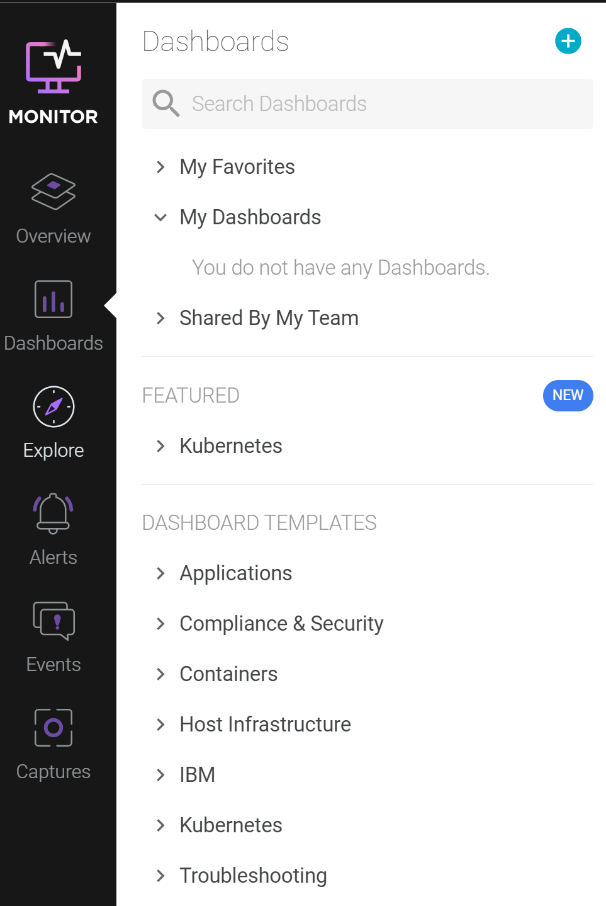
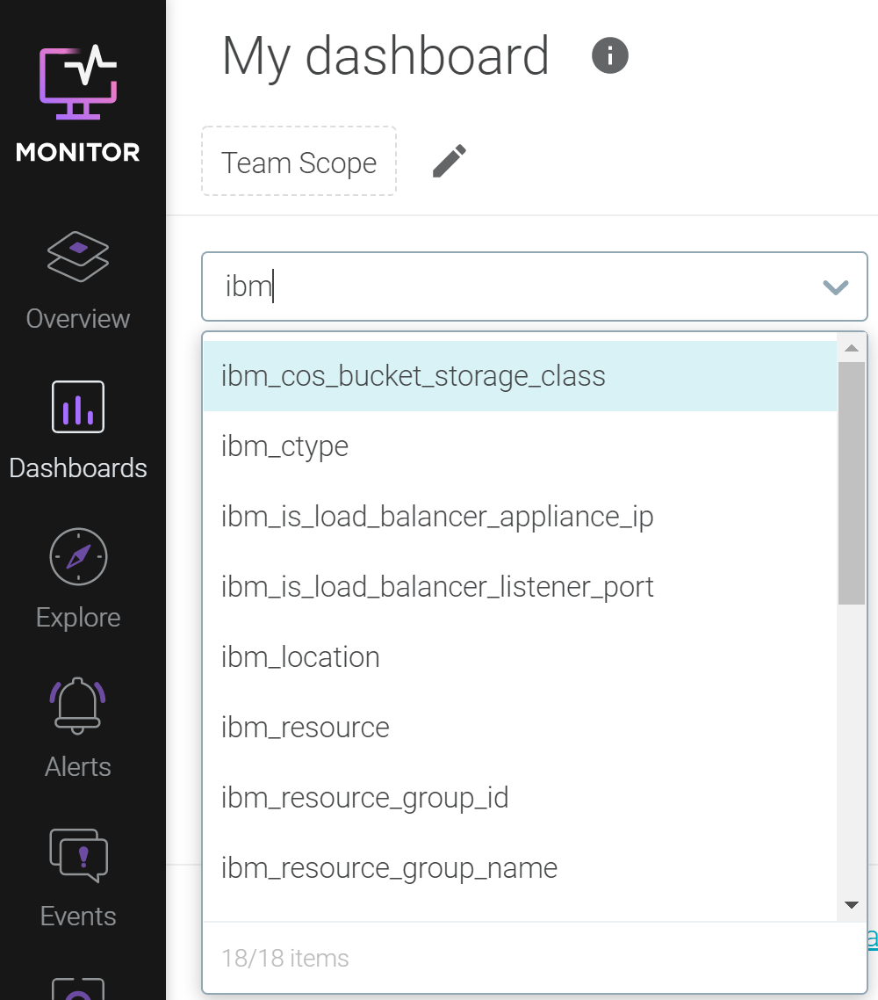
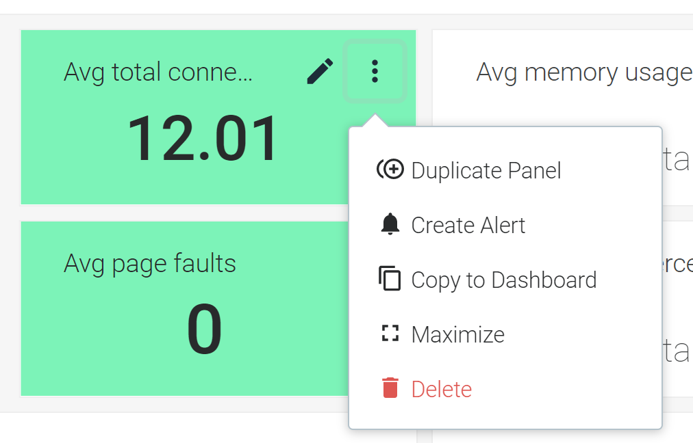
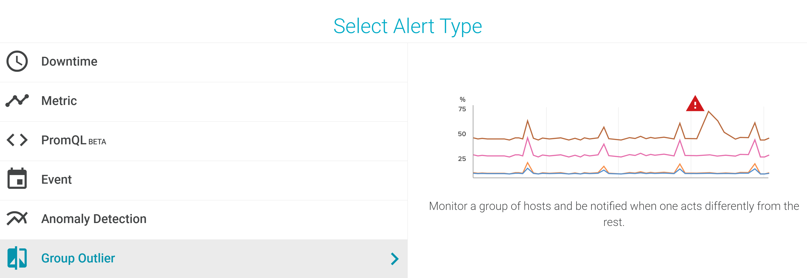
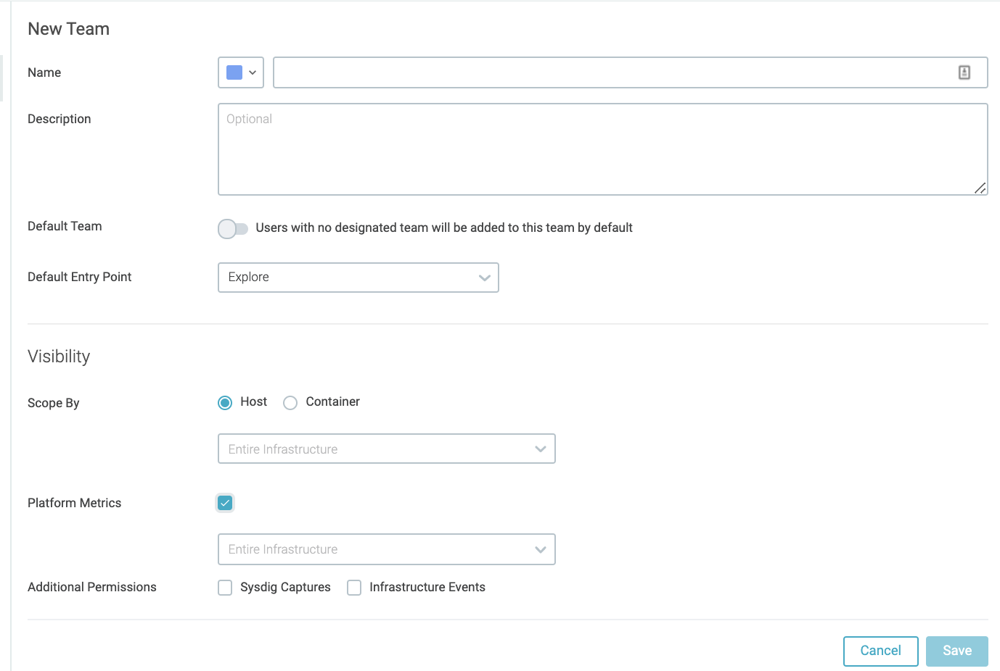
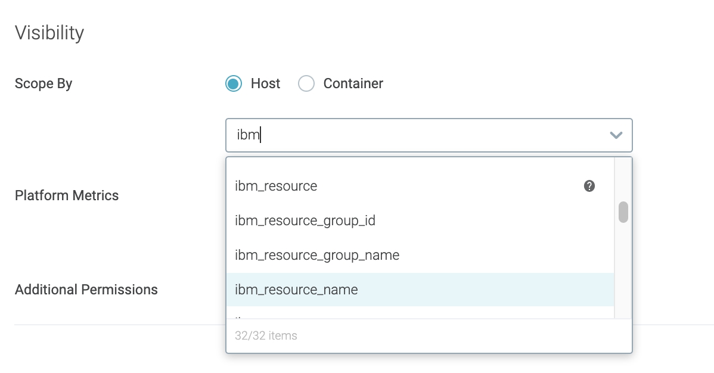

---

copyright:
  years:  2018, 2021
lastupdated: "2021-03-28"

keywords: IBM Cloud, monitoring, platform metrics

subcollection: monitoring

---

{{site.data.keyword.attribute-definition-list}}

 
# Working with platform metrics
{: #platform_metrics_working}

Platform metrics are metrics that are exposed by enabled-monitoring services and the platform in {{site.data.keyword.cloud_notm}}. 
{: shortdesc}

* Platform metrics are regional. 

    You can monitor metrics from enabled-monitoring services on the {{site.data.keyword.cloud_notm}} in the region where the service is available. 

* You can configure 1 instance only of the {{site.data.keyword.mon_full_notm}} service per region to collect *platform metrics* in that location. 

    To configure a monitoring instance, you must set the *platform metrics* configuration setting. 

    To configure platform metrics, you must be assigned the IAM Editor role or higher for the IBM Cloud Monitoring with monitoring service.

* If a monitoring instance in a region is already enabled to collect platform metrics, metrics from enabled-monitoring services are collected automatically and available for monitoring through this instance. For more information about enabled-monitoring services, see [Cloud services](/docs/monitoring?topic=monitoring-cloud_services).

* To monitor platform metrics for a service instance, check that the {{site.data.keyword.mon_full_notm}} instance is provisioned in the same region where the service instance that you want to monitor is provisioned.

## Controlling what data is visible 
{: global-attributes}

You can use attributes to segment metrics so that you can define what data is visible to users.

The following global attributes are available for segmenting metrics:

| Attribute               | Attribute Name              | Attribute Description |
|-------------------------|-----------------------------|-----------------------|
| `Cloud Type`            | `ibm_ctype`                 | Type.  Valid values: `public`, `dedicated`, or `local` |
| `Location`              | `ibm_location`              | Location of the monitored resource.   This field can be set to a region, a data center, or global. |
| `Scope`                 | `ibm_scope`                 | Scope of the metric.   This field can be set to the account GUID, an organization GUID, or a space GUID. |
| `Service name`          | `ibm_service_name`          | Name of the service generating this metric. |
| `Service instance`      | `ibm_service_instance`      | Service instance GUID that identifies the instance the metric is associated with. |
| `Service instance name` | `ibm_service_instance_name` | Service instance name.  This field provides the user-provided name of the service instance which isn't necessarily a unique value depending on the name provided by the user. |
| `Resource group name`   | `ibm_resource_group_name`   | The resource group name where the service instance is created. |
| `Resource group ID`     | `ibm_resource_group_id`     | The resource group GUID where the service instance is created. |
{: caption="Table 1. Global attributes" caption-side="top"}

Other attributes are available per {{site.data.keyword.cloud_notm}} service. In the [Cloud services](/docs/monitoring?topic=monitoring-cloud_services) topic, identify the service that you want to monitor and navigate the the *More info* section. Look for the section **Attributes for segmentation** to get the list of attributes that you can use to segment metrics for that service. 

You can control the data that is visible for analysis per team, per dashboard, and per panel in a dashboard. 

### Dashboards
{: global-attributes-1}

You can use global attributes to set the scope of dashboards:
- The scope defines the data that is valid for aggregation. 
- Only the data that is in scope is displayed. 
- The scope that is set at the dashboard level applies to all panels in the dashboard.
- You can override the main dashboard scope and specify a specific scope for a panel.

### Panels
{: global-attributes-2}

You can use global attributes to set the scope of a panel:
- The scope defines the data that is valid for aggregation. 
- Only the data that is in scope is displayed. 

### Teams
{: global-attributes-3}

You can use global attributes to define the data that is visible and available for analysis in a team.

 
## Monitoring platform metrics through dashboards
{: #platform_metrics_working_dash}

Each {{site.data.keyword.cloud_notm}} provides 1 or more dashboard templates that you can use to monitor that service. 

- Dashboard templates are available in the **Dashboards** section of the monitoring UI. 

    

- Dashboard templates are only visible in the monitoring UI if you have an instance of the service running in that region.
- Dashboard templates cannot be customized. 

You can create a copy of a dashboard template. You can customize the copy of the dashboard.

### Creating a custom dashboard
{: #platform_metrics_working_dash_1}

Complete the following steps to create a custom dashboard:

1. [Launch the monitoring UI](/docs/monitoring?topic=monitoring-launch).
2. Navigate to the **Dashboards** section () in the Web UI.
3. In the **DASHBOARD TEMPLATES** section, expand the **IBM** section, and select a dashboard template for a service that you want to monitor.
4. Select **Create Custom Dashboard**. The window *Create Dashboard from Template* opens. 
5. Enter a name for your dashboard, and click **Create and Open**. The dashboard opens.

You can locate the dashboard that you have copied in the section **Dashboards** &gt; **My Dashboads**.

Next, customize the scope and panels in the dashboard.

### Defining the scope of a dashboard
{: #platform_metrics_working_dash_2}

Complete the following steps to define the scope of the data that is displayed through the dashboard:

1. [Launch the monitoring UI](/docs/monitoring?topic=monitoring-launch).
2. Navigate to the **Dashboards** section () in the Web UI.
3. Select a custom dashboard in the **My Dashboards** section.
4. To modify the scope, click the pencil icon to  **Edit Dashboard Scope**.

    

5. In the drop-down box, enter **ibm** and select an attribute. 

    

6. Select an operator.

    

7. Select 1 or more values.

    

    You can also leave the value empty, and select **var** to define a variable so that users can choose 1 or more values when they analyze data through the dashboard.
    {: note}

8. Continue adding more attributes. When you have the scope defined, click **Save**.

### Defining the scope of a panel
{: #platform_metrics_working_dash_3}

Complete the following steps to define the scope of the data that is displayed through a panel in a dashboard:

1. [Launch the monitoring UI](/docs/monitoring?topic=monitoring-launch).
2. Navigate to the **Dashboards** section () in the Web UI.
3. Select a custom dashboard in the **My Dashboards** section.
4. Select a panel where you want to change the scope of the data.
5. Click the *Pencil* icon . Then, in the *Scope* section, click **Dashboard scope**.

    

6. By default, *Inherit Dashboard Scope* is selected. To specify a custom scope, you must de-select this option.

    In the drop-down box, enter **ibm** and select an attribute. 

    Select an operator.

    Select 1 or more values.

7. In a panel, you can configure 1 or more metrics. Select **Apply to All Queries** if you want the scope to apply to all the metrics that are configured for the panel.

To save the scope, you must click **Save** at the panel level.

## Configuring an alert on a platform metric
{: #platform_metrics_working_alert}

### Configuring an alert from a panel
{: #platform_metrics_working_alert_1}

Complete the following steps to define an alert on a metric:

1. [Launch the monitoring UI](/docs/monitoring?topic=monitoring-launch).
2. Verify that you have a notification channel that defines how you want to be notified.

    You can enabled 1 or more notification channels when you configure an alert. If you need multiple notification channels, check they are available.

3. Navigate to the **Dashboards** section () in the Web UI.
4. Select a custom dashboard in the **My Dashboards** section.
5. Select the panel for which you want to define the alert.

    Before you create the alert, check the scope of the metric that is configured in the panel. This scope is automatically included in the alert definition.
    {: note}

6. Click the *Actions* icon  and select **Create Alert**.

    

    If you have multiple queries defined in a panel, you are prompted to select the metric for which you want to create an alert.
    {: note}

7. Configure the alert. Set the following fields:

    **Name**: Enter a name for the alert. 

    **Description**: Add a description that other users can read to get more context. This field is optional.

    **Group**: The alert group this alert will be part of.  If not specified, the alert will be part of the default group.

    **Severity**: Set the level of criticality of the alert. Valid values are `High`, `Medium`, `Low`, and `Info`.

    **Metric**: This field is set to the metric that you have selected from the panel. Check that the metric and aggregation are the ones that you need.

    **Scope**: This field is set to the scope that you have defined for the metric in the panel. Check that the scope is the one that you need.

    **Trigger**: Define the condition and threshold value that must be evaluated. It also defines whether the alert sends a single alert or multiple alerts. Valid time scales are `minute`, `hour`, or `day`. A single alert fires an alert for the entire scope. Multiple Alerts are sent if 1 or more segments breach the threshold at once. An alert is sent for each segment that you specify.

    **Notification Channel**: Enable 1 or more notification channels. 

## Configuring an alert from the Alerts section
{: #platform_metrics_working_alert_2}

You can define a `metric` alert directly from the *Alerts* section.

Complete the following steps to define an alert on a metric:

1. [Launch the monitoring UI](/docs/monitoring?topic=monitoring-launch).

2. Verify that you have a notification channel that defines how you want to be notified.

    You can enabled 1 or more notification channels when you configure an alert. If you need multiple notification channels, check they are available.

3. Navigate to the **Alerts** section ) in the Web UI.

4. Select **Add Alert**.

    

5. Select your desired alert type.

    

5. Configure the alert. Set the following fields:

    **Name**: Enter a name for the alert. 

    **Description**: Add a description that other users can read to get more context. This field is optional.

    **Group**: The alert group this alert will be part of.  If not specified, the alert will be part of the default group.

    **Severity**: Set the level of criticality of the alert. Valid values are `High`, `Medium`, `Low`, and `Info`.

    **Metric**: Configure the metric.

    **Scope**: Configure the scope

    **Trigger**: Define the condition and threshold value that must be evaluated. It also defines whether the alert sends a single alert or multiple alerts. Valid time scales are `minute`, `hour`, or `day`. A single alert fires an alert for the entire scope. Multiple Alerts are sent if 1 or more segments breach the threshold at once. An alert is sent for each segment that you specify.

    **Notification Channel**: Enable 1 or more notification channels.

## Controlling the access to platform metrics for a team
{: #platform_metrics_working_team}

You can control the data that is visible to all the users that are members of a team.

First navigate to the **Settings** section.

As an administrator of the service, you can create, modify, and delete teams. When you configure a team, you can define the scope of the data in the **Visibility** section.

To allow a team to view platform metrics, you must select **Platform metrics**.

Enabling platform metrics, grants access to all platform metrics. However, you can reduce the scope by configuring 1 or more segments. Notice that the order of the segments is applied from the beginning of the list to the end.

### Limiting access to platform metrics by resource group
{: #platform_metrics_working_team_rg}

Complete the following steps to limit the data to metrics collected for services that are created in that resource group:

1. [Launch the monitoring UI](/docs/monitoring?topic=monitoring-launch).

2. Navigate to the **Settings** section.

    

3. Select **Teams**. Then, select a team where you want to restrict access to the platform metrics.

4. In the *Visibility* section, select **Platform metrics**.

5. Select the attribute **ibm_resource_group_id** to segment data by resource group. 

    

6. Select 1 or more resource groups for which you want the data to be visible to users that are members of this team.

7. Add additional `global` attributes. Other attributes are available per {{site.data.keyword.cloud_notm}} service. In the [Cloud services](/docs/monitoring?topic=monitoring-cloud_services) topic, identify the service that you want to monitor and navigate the the *More info* section. Look for the section **Attributes for segmentation** to get the list of attributes that you can use to segment metrics for that service. 

8. Click **Save**.

### Limiting access to platform metrics by instance
{: #platform_metrics_working_team_1}

Complete the following steps:

1. [Launch the monitoring UI](/docs/monitoring?topic=monitoring-launch).

2. Navigate to the **Settings** section.

    

3. Select **Teams**. Then, select a team where you want to restrict access to the platform metrics.

4. In the *Visibility* section, select **Platform metrics**.

5. Select the attribute **ibm_service_instance** to segment data by instance ID. 

6. Select 1 or more instance IDs for which you want the data to be visible to users that are members of this team.

7. Add additional `global` attributes. Other attributes are available per {{site.data.keyword.cloud_notm}} service. In the [Cloud services](/docs/monitoring?topic=monitoring-cloud_services) topic, identify the service that you want to monitor and navigate the the *More info* section. Look for the section **Attributes for segmentation** to get the list of attributes that you can use to segment metrics for that service. 

8. Click **Save**.

