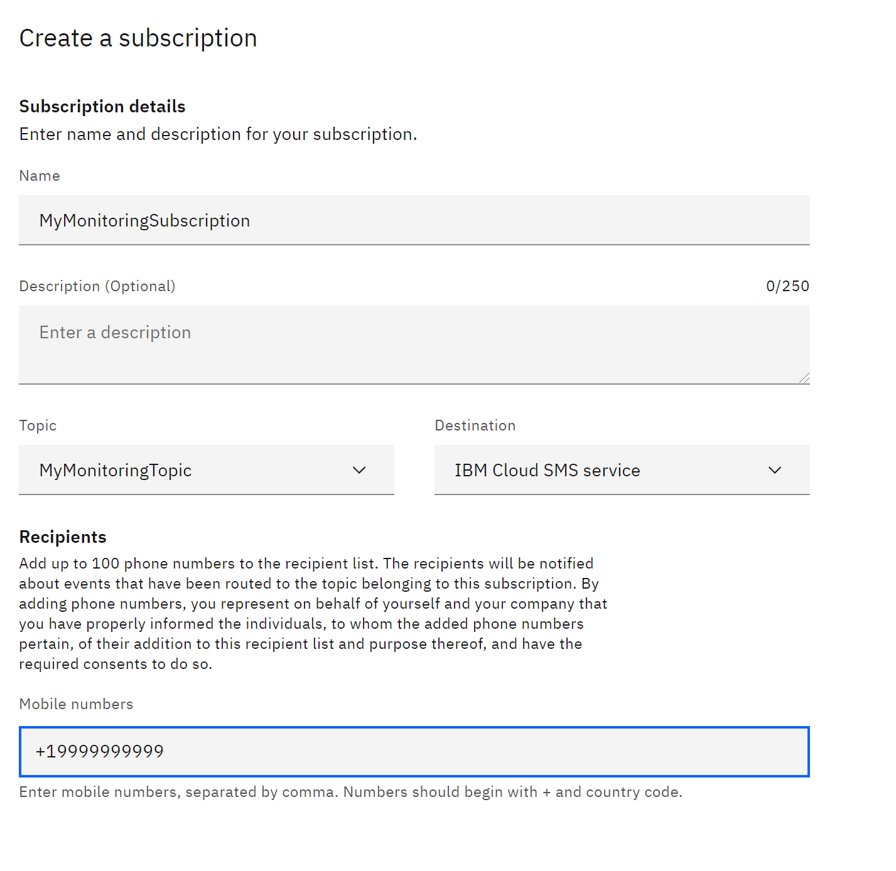
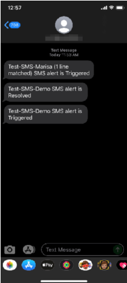

---

copyright:
   years: 2020
lastupdated: "2021-12-17"

keywords: IBM Cloud, monitoring, alerts, event notification

subcollection: monitoring

content-type: tutorial
services: event-notifications, monitoring
account-plan: lite
completion-time: 1h

---

{{site.data.keyword.attribute-definition-list}}

# Sending SMS notifications to {{site.data.keyword.en_full_notm}}
{: #tutorial-en-sms}
{: toc-content-type="tutorial"}
{: toc-services="event-notifications, monitoring"}
{: toc-completion-time="1h"}

In this tutorial, you learn how to set up {{site.data.keyword.mon_full}} to send alert notifications to {{site.data.keyword.en_full_notm}}. For this tutorial {{site.data.keyword.en_full_notm}} is configured to send SMS notifications to subscribers.
{: shortdesc}

SMS messages can only be sent to phone numbers in the United States and Canada.
{: important}

{{site.data.keyword.en_full_notm}} supports message concatenation so SMS messages longer than 160 characters can be sent.  However, messages will be sent in blocks of at most 160 characters.  Multiple messages might result in additional charges to the recipient.
{: note}

{: caption="Figure 1. Data flow for this tutorial" caption-side="bottom"}

In this tutorial you will configure the following flow:

1. An alert is raised in {{site.data.keyword.mon_full_notm}}.
2. {{site.data.keyword.mon_full_notm}} sends a notification to {{site.data.keyword.en_full_notm}}.
3. {{site.data.keyword.en_full_notm}} creates an SMS message and sends the SMS message to the subscribed user.

{{site.data.content.en-prereqs}}

{{site.data.content.en-login}}

{{site.data.content.en-create-instance}}

{{site.data.content.en-permissions}}

{{site.data.content.en-notification}}

{{site.data.content.en-topic}}

## Create an {{site.data.keyword.en_full_notm}} destination
{: #en-destination-sms}
{: step}

In this step you will make sure that an SMS destination exists where notifications will be forwarded.

1. Click **Destinations**. 
2. Notice in the **Destinations** list that, by default, there is an *IBM Cloud SMS service* defined.  You do not need to do anything else to configure an SMS destination.

   If you wanted to add a webhook as a destination, you would click **Add** and provide the appropriate information in the **Add a destination** panel.
   {: note}

## Create an {{site.data.keyword.en_full_notm}} SMS subscription
{: #en-subscription-sms}
{: step}

In this step you will configure who will receive an SMS message when a notification is processed.

1. Click **Subscriptions**.
2. Click **Create**. The **Create a subscription** panel opens.
3. In the **Create a subscription** panel enter the following:
    
    * Enter the **Name** for your subscription.  For example, `MyMonitoringSubscription`.
    * For **Topic**, select the topic you created.  For example, `MyMonitoringTopic`.
    * For **Destination**, select `IBM Cloud SMS service`.
    * For **Recipients**, enter up to 100 phone numbers to receive SMS messages.  Phone numbers must be specified as a `+` followed by the country code and full number specified without dashes.  For example, `+19999999999`.  Only phone numbers in the United States and Canada can be specified.

    {: caption="Figure 5. Create subscription" caption-side="bottom"}

4. Click **Create**.  Your subscription will be added to the **Subscriptions** list.

    {: caption="Figure 5. Subscriptions list" caption-side="bottom"}

{{site.data.content.en-mon-notification}}

## Next steps
{: #en-next-steps}

You should start receiving SMS notifications at the phone numbers that you configured whenever the criteria defined in both {{site.data.keyword.mon_full_notm}} and {{site.data.keyword.en_full_notm}} match.

{: caption="Figure 6. SMS example" caption-side="bottom"}

